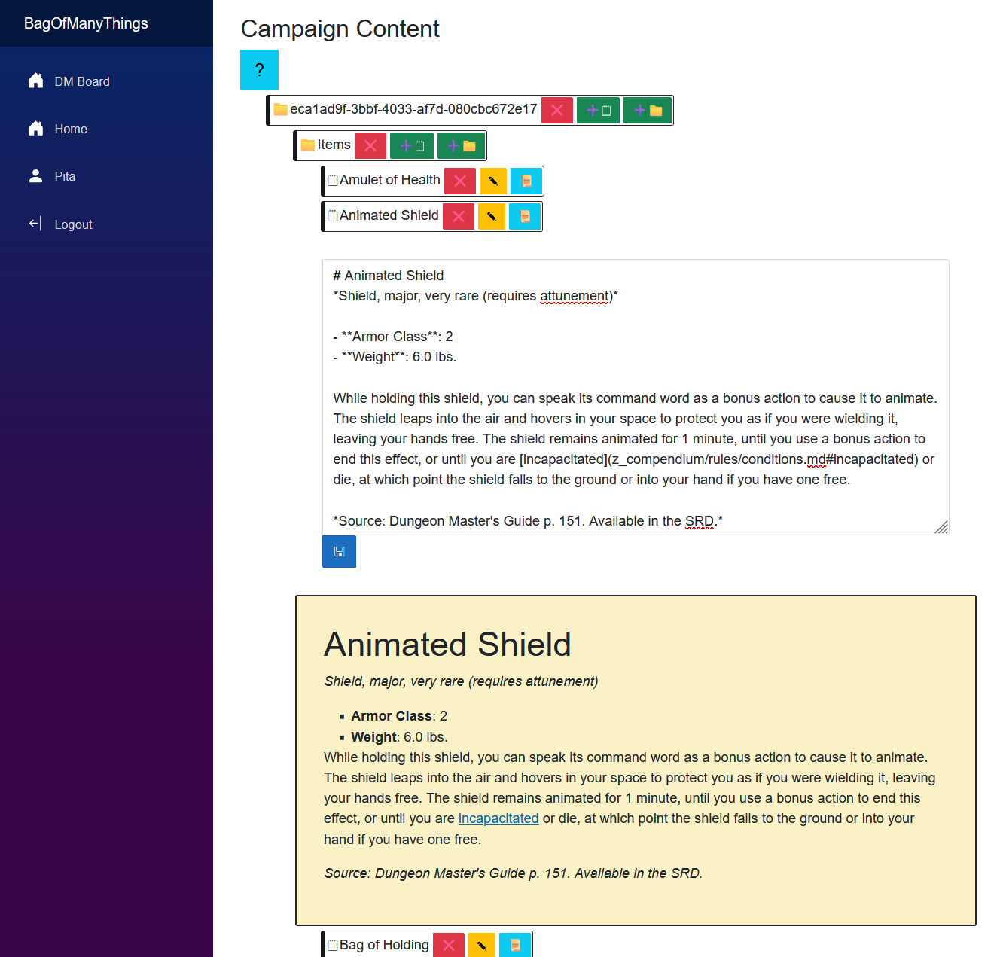

# Bag of Many Things
A note taking tool made in Blazor by Ayham Muati

  

---

Hi all! My primary objective was to get experience with creating a web-based application using the Blazor framework .

## Features
### Markdown Editor
Provides a way for Dungeon Masters (and soon enough players) to edit notes then to preview them in Markdown. There is a Markdown cheat sheet available for those who aren't familiar with the language.

### Folder-Based Note Storage System
I provide an account based storage system, storing the player's data on the server through their account ID and using a recursive folder note reading that goes through each folder and provides all the notes available.
I also provide folder and folder creation and deletion functionality.

### Role Management
When creating an account you select between being a Dungeon Master and a player, and I've set it up this way for now even though there's not much difference between a player and a Dungeon Master currently because I'm planning to implement different sections for each role int he future.

## Potential Additions
### AI Implementation
Using AI to aid Dungeon Masters with generating fantasy content based on their campaign.

### Invite System
A way for a Dungeon Master to invite a player into their campaign to share specific notes with them.

### Intelligent Information Retrieval
Using AI to implement smart connections between notes for easier search and information retrieval. (Relationships between characters, events, and dates)

### Intelligent Information Retrieval
Using AI to implement smart connections between notes for easier search and information retrieval. (Relationships between characters, events, and dates)
